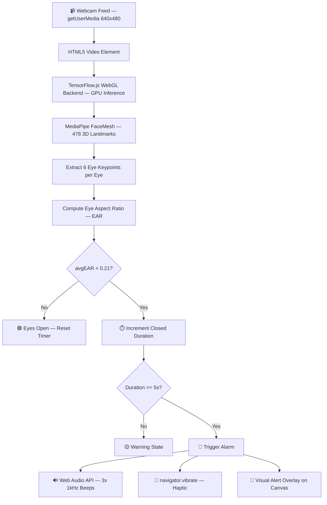

# Drowsiness Detection System

[](https://your-deployment-url.onrender.com)
[](https://react.dev/)
[](https://www.typescriptlang.org/)
[](https://www.tensorflow.org/js)
[](https://expressjs.com/)

---

## 1. Overview

### What the project does
A real-time, browser-based drowsiness detection web application that monitors a user's eyes via webcam and triggers an audio alarm when their eyes remain closed for 5 or more continuous seconds. All computer vision inference runs entirely on-device — no video data ever leaves the browser.

### Problem it solves
Driver fatigue and microsleeps are responsible for a significant share of road accidents globally. Existing solutions require specialized hardware or dedicated apps. This system works on any device with a browser and a webcam — no installation, no hardware, no data sent to any server.

### Key Features
- Real-time eye tracking at up to 30 FPS using MediaPipe FaceMesh (478 3D facial landmarks)
- Eye Aspect Ratio (EAR) algorithm to measure eye openness scientifically
- Audio alarm via Web Audio API — 3 beeps at 1kHz when eyes are closed for 5+ seconds
- Haptic vibration on mobile devices (`navigator.vibrate`)
- Canvas overlay rendering EAR value, eye outlines, and status in real time
- Fallback brightness-based detector with zero model download time
- User authentication — local email/password + Google OAuth2
- Resume Builder and Resume Screener as additional features

### Tech Stack
React 19 · TypeScript 5.6 · TensorFlow.js 4.22 · MediaPipe FaceMesh · Vite 7 · TailwindCSS v4 · Express 5 · Passport.js · Drizzle ORM · PostgreSQL · Render.com

---

## 2. Demo

**Live Application:** [your-deployment-url.onrender.com](https://your-deployment-url.onrender.com)

> Replace the URL above once deployed. Navigate to `/drowsiness` to use the detector.

### How to test it
1. Open the live URL and go to `/drowsiness`
2. Click **Start Detection** and allow camera access
3. Keep your eyes open — status shows `EYES OPEN` in green
4. Close your eyes for 5 seconds — the alarm triggers with 3 beeps

### API Endpoints
| Method | Endpoint | Description |
|--------|----------|-------------|
| `GET` | `/api/auth/me` | Get current authenticated user |
| `POST` | `/api/auth/register` | Register with email + password |
| `POST` | `/api/auth/login` | Login with email + password |
| `POST` | `/api/auth/logout` | Logout and destroy session |
| `GET` | `/api/auth/google` | Initiate Google OAuth2 flow |
| `GET` | `/api/auth/google/callback` | Google OAuth2 callback |
| `GET` | `/api/health` | Server health check |
| `GET` | `/api/ready` | Readiness check (storage dependency) |

---

## 3. Architecture

### High-Level Diagram



### Component Breakdown

| Component | Responsibility |
|-----------|---------------|
| `DrowsinessDetector.tsx` | Core detection — loads TF model, runs rAF loop, computes EAR, triggers alarm |
| `SimpleDrowsinessDetector.tsx` | Fallback detector using pixel brightness sampling — no model download |
| `server/routes.ts` | All auth API routes — local + Google OAuth2 via Passport.js |
| `server/storage.ts` | In-memory user store (swappable to PostgreSQL via Drizzle ORM) |
| `shared/schema.ts` | Drizzle + Zod user schema shared between client and server |
| `script/build.ts` | Custom build — Vite for client, esbuild for server bundle |

### Request Flow

```
User opens /drowsiness
    → React Router (Wouter) renders DrowsinessDetector
    → tf.ready() initialises TensorFlow.js WebGL backend
    → faceLandmarksDetection.createDetector() loads MediaPipe model
    → navigator.mediaDevices.getUserMedia() opens webcam
    → requestAnimationFrame loop starts
        → estimateFaces(video) runs on every frame
        → 6 keypoints extracted per eye
        → EAR computed via Math.hypot (Euclidean distance)
        → if avgEAR < 0.21 for 5s → playAlarm() via Web Audio API
```

---

## 4. Tech Stack

| Layer | Technology | Why |
|-------|------------|-----|
| Frontend | React 19 | Component-based UI, concurrent rendering |
| Language | TypeScript 5.6 | Type safety across client + server |
| Build Tool | Vite 7 | HMR in dev, optimised production bundle |
| ML Engine | TensorFlow.js 4.22 | GPU-accelerated inference via WebGL — no Python, no server |
| CV Model | MediaPipe FaceMesh | 478 3D landmarks, proven accuracy on face geometry |
| Styling | TailwindCSS v4 | Utility-first, no CSS bloat |
| UI Components | Radix UI + shadcn/ui | Accessible, unstyled primitives |
| Routing | Wouter | 1.5KB router — no React Router overhead |
| Server State | TanStack Query v5 | Caching, background refetch, loading states |
| Backend | Express 5 | Lightweight REST API + static file serving |
| Auth | Passport.js | Strategy pattern — pluggable local + OAuth2 |
| Password Hash | Node.js `crypto.scrypt` | Memory-hard, timing-safe — better than bcrypt for this stack |
| Session | express-session + memorystore | Server-side sessions, no JWT complexity |
| ORM | Drizzle ORM + Zod | Type-safe queries, schema-first validation |
| Database | PostgreSQL | Relational, reliable user persistence |
| Deployment | Render.com | `render.yaml` config, zero-click deploys from GitHub |

---

## 5. Project Structure

```
drowsiness-detection-system/
│
├── client/                          # Frontend React SPA
│   ├── index.html                   # HTML entry point
│   ├── public/                      # Static assets (favicon, template images)
│   └── src/
│       ├── App.tsx                  # Root component — router + providers setup
│       ├── main.tsx                 # React DOM entry point
│       ├── index.css                # Global styles + Tailwind base
│       │
│       ├── components/
│       │   ├── DrowsinessDetector.tsx        # PRIMARY: TF.js + EAR algorithm
│       │   ├── SimpleDrowsinessDetector.tsx  # FALLBACK: brightness-based detection
│       │   ├── layout/Navbar.tsx             # Navigation header
│       │   └── ui/                           # ~50 shadcn/ui component primitives
│       │
│       ├── pages/
│       │   ├── Home.tsx                      # Landing page
│       │   ├── login.tsx                     # Login + registration page
│       │   ├── drowsiness/index.tsx          # Mounts DrowsinessDetector
│       │   ├── builder/index.tsx             # Resume builder feature
│       │   └── screener/index.tsx            # Resume screener feature
│       │
│       ├── hooks/
│       │   ├── use-mobile.tsx                # Responsive breakpoint hook
│       │   └── use-toast.ts                  # Toast notification hook
│       │
│       └── lib/
│           ├── auth.ts                       # Auth API calls
│           ├── queryClient.ts                # TanStack Query client config
│           └── utils.ts                      # cn() utility (clsx + tailwind-merge)
│
├── server/                          # Node.js + Express backend
│   ├── index.ts                     # Server entry — port binding + middleware
│   ├── routes.ts                    # All API routes + auth strategies
│   ├── storage.ts                   # IStorage interface + MemStorage implementation
│   ├── static.ts                    # Serves built client in production
│   └── vite.ts                      # Vite dev middleware (dev only)
│
├── shared/                          # Shared between client and server
│   └── schema.ts                    # Drizzle table definitions + Zod insert schemas
│
├── script/
│   └── build.ts                     # Build script: Vite (client) + esbuild (server)
│
├── .env.example                     # Environment variable template
├── render.yaml                      # Render.com deployment configuration
├── components.json                  # shadcn/ui registry config
├── drizzle.config.ts                # Drizzle ORM + migration config
├── vite.config.ts                   # Vite config — aliases, plugins, proxy
├── tsconfig.json                    # TypeScript project config
└── package.json                     # Dependencies + npm scripts
```

---

## 6. Database Design

### Users Table

```sql
CREATE TABLE users (
  id       VARCHAR PRIMARY KEY DEFAULT gen_random_uuid(),
  username TEXT NOT NULL UNIQUE,   -- stores email address
  password TEXT NOT NULL           -- scrypt hash: "salt:derivedKey"
);
```

### ER Diagram

```
┌──────────────────────────┐
│          users           │
├──────────────────────────┤
│ id       VARCHAR  (PK)   │
│ username TEXT     UNIQUE │
│ password TEXT            │
└──────────────────────────┘
```

### Notes
- `id` is a UUID generated by PostgreSQL's `gen_random_uuid()` — no sequential IDs exposed
- `username` stores the email address (unique constraint prevents duplicate accounts)
- `password` is stored as `salt:derivedKey` — the salt is a random 16-byte hex string, the derived key is 64 bytes via `scryptSync`
- The schema is defined in `shared/schema.ts` using Drizzle ORM with `drizzle-zod` for automatic Zod validation schemas

---

## 7. API Overview

### Authentication
All auth routes use session cookies (`connect.sid`). The session is HTTP-only, SameSite=lax, and Secure in production.

### Endpoints

**Register**
```http
POST /api/auth/register
Content-Type: application/json

{
  "email": "user@example.com",
  "password": "mypassword123",
  "displayName": "Chandan"
}
```
```json
{ "ok": true, "user": { "id": "uuid", "displayName": "Chandan", "email": "user@example.com" } }
```

**Login**
```http
POST /api/auth/login
Content-Type: application/json

{
  "email": "user@example.com",
  "password": "mypassword123"
}
```
```json
{ "ok": true, "user": { "id": "uuid", "displayName": "user", "email": "user@example.com" } }
```

**Get current user**
```http
GET /api/auth/me
```
```json
{ "authenticated": true, "user": { "id": "uuid", "displayName": "Chandan", "email": "user@example.com" } }
```

**Health check**
```http
GET /api/health
```
```json
{ "status": "ok", "uptimeSec": 120, "timestamp": "2025-01-01T00:00:00.000Z" }
```

---

## 8. Key Features

### Real-Time Eye Tracking
MediaPipe FaceMesh detects 478 3D facial landmarks per frame. The system reads 12 of them (6 per eye) on every animation frame and feeds them into the EAR algorithm.

### Eye Aspect Ratio (EAR) Algorithm
Based on the Soukupová & Čech 2016 paper. Uses Euclidean distances between eye landmark coordinates:

```
EAR = ( ||p2 - p6|| + ||p3 - p5|| ) / ( 2 × ||p1 - p4|| )

        p2    p3
         •----•
p1 •              • p4
         •----•
        p6    p5

Eyes OPEN  → EAR ≈ 0.28–0.35
Eyes CLOSED → EAR ≤ 0.21
```

### Drowsiness Alert System
- EAR is checked every frame against threshold `0.21`
- A `useRef` timestamp tracks when eyes first closed
- After **5 continuous seconds** below threshold → alarm fires once (`hasAlertedRef` prevents repeat)
- Eyes reopening resets the entire timer and alert state

### Audio Alarm
Generated via Web Audio API — no audio files:
```ts
oscillator.frequency.value = 1000; // 1kHz
oscillator.type = 'sine';
// 3 beeps × 300ms each, 400ms apart
```

### Authentication
- Local email + password (scrypt hashing)
- Google OAuth2 (Passport.js strategy)
- Session-based (no JWT)

### Fallback Detector
`SimpleDrowsinessDetector` uses pixel brightness sampling on approximate eye regions. Starts instantly (no model download). Less accurate but useful on slow connections.

### Canvas Overlay
Draws all 478 face landmarks as green dots, highlights the 12 eye points, draws eye outlines in red (closed) or green (open), and shows live EAR values as text.

---

## 9. Security

### Password Hashing
`crypto.scryptSync` with a 16-byte random salt per user. Output: `"salt:derivedKey"` stored as one string. Verification uses `timingSafeEqual` to prevent timing attacks.

```ts
function hashPassword(password: string): string {
  const salt = randomBytes(16).toString('hex');
  const hash = scryptSync(password, salt, 64).toString('hex');
  return `${salt}:${hash}`;
}
```

### Session Security
- `httpOnly: true` — inaccessible to JavaScript
- `sameSite: 'lax'` — CSRF protection
- `secure: true` in production — HTTPS only
- 7-day expiry with memorystore TTL

### Google OAuth2
- Client ID and Secret stored in environment variables only
- Callback URL validated server-side
- State parameter used to prevent CSRF in OAuth flow

### Input Validation
- Zod schemas validate all incoming request bodies
- Email and password presence checked before any DB query
- Duplicate email check returns 409 before attempting insert

### Privacy
All webcam processing is 100% on-device. TensorFlow.js runs inference on the local GPU via WebGL. The video stream never leaves the browser — there is no backend API for the detection feature.

---

## 10. Performance & Scalability

### requestAnimationFrame Loop
`rAF` syncs with the display refresh rate (~60fps) and automatically pauses when the tab is backgrounded — unlike `setInterval` which keeps running. This saves significant CPU/GPU when the user switches tabs.

### useRef over useState in Detection Loop
Timer values and state flags inside the rAF loop are stored in `useRef`, not `useState`. Setting state on every frame would cause React to re-render 60 times per second — refs avoid this entirely while remaining accessible inside closures.

### Model Configuration
```ts
{
  maxFaces: 1,           // only process one face — halves work vs. multi-face
  refineLandmarks: false // disables iris refinement — not needed for EAR
}
```

### TensorFlow.js WebGL Backend
Inference runs on the GPU (not CPU). WebGL shaders parallelize the matrix operations of the FaceMesh model, making ~30 FPS achievable in-browser.

### Build Optimisation
- Vite produces a tree-shaken, code-split production bundle
- esbuild compiles the server to a single `.cjs` bundle for fast cold start
- `package-lock.json` ensures reproducible installs

### Scaling the Backend
The Express server is stateless per request — sessions are stored in memorystore (swap to Redis for multi-instance). To scale horizontally: switch `memorystore` → `connect-redis`, add a load balancer, deploy multiple instances on Render or a container platform.

---

## 11. Installation

### Prerequisites
- Node.js v20+
- npm v10+
- A webcam (built-in laptop camera works)

### Clone and Run

```bash
git clone https://github.com/chandanm0005/Drowsiness-Detection-System.git
cd Drowsiness-Detection-System
npm install
npm run dev
```

App starts on **http://localhost:5030**

Navigate to **http://localhost:5030/drowsiness** to use the detector.

### Environment Variables

Copy `.env.example` to `.env`:

```bash
cp .env.example .env
```

Fill in:

```env
# Required for session encryption
SESSION_SECRET=replace-with-a-long-random-string

# Optional — only needed for Google OAuth login
GOOGLE_CLIENT_ID=your-google-client-id.apps.googleusercontent.com
GOOGLE_CLIENT_SECRET=your-google-client-secret
```

Google OAuth is fully optional. Local auth and the drowsiness detection feature work without it.

### Available Scripts

```bash
npm run dev      # Start development server (client + server with HMR)
npm run build    # Production build (Vite client + esbuild server)
npm run start    # Start production server
npm run check    # TypeScript type check
npm run db:push  # Push Drizzle schema to PostgreSQL
```

---

## 12. Deployment

### Render.com (Recommended)

The repo includes `render.yaml` for one-click deployment:

```yaml
services:
  - type: web
    name: drowsiness-detection-system
    env: node
    buildCommand: npm install && npm run build
    startCommand: npm run start
    envVars:
      - key: NODE_ENV
        value: production
      - key: SESSION_SECRET
        generateValue: true
```

Steps:
1. Push to GitHub
2. Go to [render.com](https://render.com) → **New Web Service**
3. Connect `chandanm0005/Drowsiness-Detection-System`
4. Render reads `render.yaml` automatically
5. Add `GOOGLE_CLIENT_ID` and `GOOGLE_CLIENT_SECRET` in the dashboard if using Google OAuth
6. Click **Deploy**

### Environment Variables on Render
Set these in the Render dashboard under **Environment**:
- `SESSION_SECRET` — auto-generated by `render.yaml`
- `GOOGLE_CLIENT_ID` — optional
- `GOOGLE_CLIENT_SECRET` — optional
- `DATABASE_URL` — optional, only if using PostgreSQL instead of in-memory store

---

## 13. Future Improvements

- **PERCLOS metric** — Percentage of Eye Closure over time (more accurate than single-threshold EAR)
- **Head pose estimation** — detect nodding off even with eyes open
- **Yawn detection** — mouth landmark tracking as a secondary drowsiness signal
- **Session history** — log alert timestamps to a dashboard with graphs
- **Configurable threshold** — let users set their own EAR threshold and alert delay
- **Mobile PWA** — service worker + manifest for offline use and home screen install
- **Redis sessions** — replace memorystore for multi-instance horizontal scaling
- **WebRTC multi-device** — stream detection results to a second device (e.g., passenger phone)

---

## 14. Talking Points

### Why run inference in the browser instead of a backend?
Privacy is the primary reason. Sending a live webcam stream to a server is a significant trust and data risk. TensorFlow.js with the WebGL backend runs inference on the local GPU — no video ever leaves the device. It also eliminates server load entirely for the core feature.

### Why TensorFlow.js and MediaPipe over Python/OpenCV?
Python + OpenCV is the traditional approach, but it requires a local Python environment, model files, and backend infrastructure. TensorFlow.js runs the same model in any modern browser — zero installation for the user, works cross-platform, and the MediaPipe FaceMesh model is production-grade (Google uses it in Meet and Photos).

### Biggest challenge
Getting the alarm to fire exactly once per closure event. The `rAF` loop runs ~60 times per second, so without `hasAlertedRef`, the alarm would retrigger every frame once the threshold was exceeded. A ref flag (`hasAlertedRef`) that resets only when eyes reopen solves this cleanly without any debounce overhead.

### Why `useRef` instead of `useState` for the timer?
`useState` triggers a React re-render on every update. Inside a 60fps loop, that means 60 re-renders per second — a significant performance problem. `useRef` gives a mutable container that doesn't trigger re-renders, is always current inside the closure, and has zero overhead.

### Why EAR threshold 0.21?
The original Soukupová & Čech paper suggests 0.3 as a general blink-detection threshold, but 0.3 causes false positives from normal slow blinks. 0.21 is conservative enough to only trigger on deliberate or involuntary sustained closure.

### Why 5 seconds as the alert threshold?
A normal blink is 150–400ms. A microsleep (the precursor to fatigue accidents) starts at around 2–5 seconds. 5 seconds eliminates false alarms from natural blinking patterns while still catching genuine drowsiness early.

### Trade-offs made
- **Accuracy vs. speed**: `refineLandmarks: false` speeds up inference but loses iris-level precision. For EAR, the 6 eyelid points are sufficient — iris refinement adds no value.
- **Simplicity vs. persistence**: In-memory session store instead of Redis. Faster to set up, but sessions are lost on server restart. Acceptable for a demo; Redis would be the production swap.
- **Browser-only vs. native**: Running in the browser limits access to device sensors and background processing. A native app would be more reliable for continuous monitoring, but the browser approach has zero-friction access for users.


